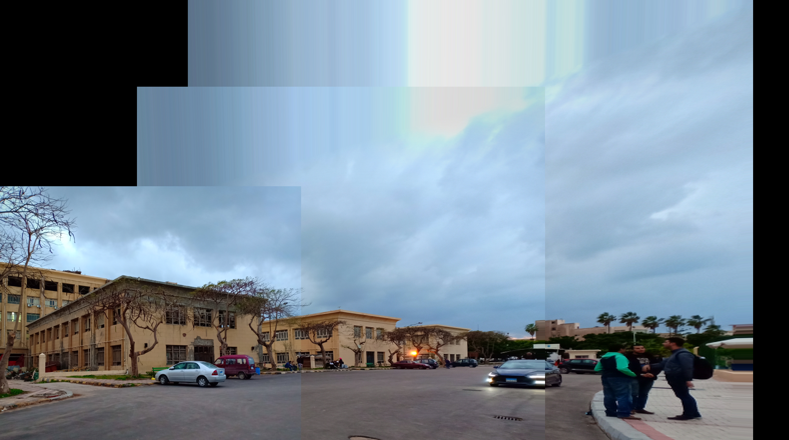

### Description
An implementation of image stitching that uses OpenCV only for extracting features.

### Dependencies
- python 3.6
- matplotlib
- numpy
- scipy
- openCV 2.0

### Usage
```
python main.py images1 image2 [-h] [--no_sift] [--no_ransac] [--num_points NUM_POINTS]
```
### Example output

      
